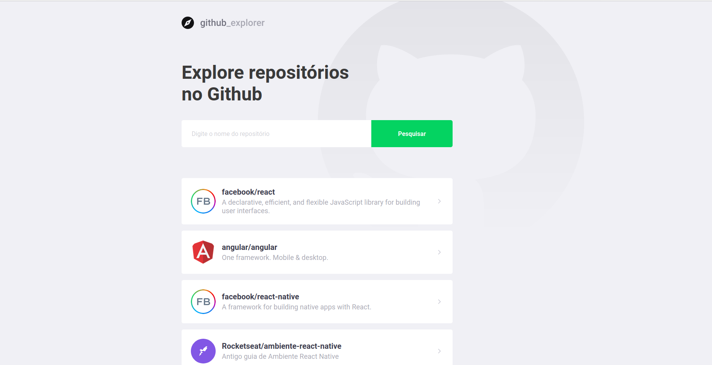

<p align="center">
  

  

  
</p>
<h1 align="center">
    
</h1>

<h4 align="center">
	🚀 Github Explorer ♻️
</h4>

<p align="center">
 <a href="#-about">About</a> •
 <a href="#-features">Features</a> •
 <a href="#-setup">Setup</a> •
 <a href="#-technologies">Technologies</a> •
 <a href="#-author">Author</a>
</p>


## 💻 About

♻️ Github Explorer - Browse and explore the repositories on Github.

Project developed with React, Typescript, Styled-Components and I18n.


## ⚙️ Features

- [x] Integration with Github API
- [x] User performs the repository search
  - [x] If found, the repository is listed and saved to local storage
  - [x] Otherwise, an error message is displayed to the user
- [x] Access to the repository is possible to view:
  - Forks
  - Stars
  - Issues
  - All Issues are listed in a list
- [x] User can choose between English and Portuguese languages.

## 🌐 Live Example

[You can access a Live Example clicking Here! 😁](https://github-explorer-fjcy.vercel.app/)

## Examples

<p align="center" style="display: flex; align-items: flex-start; justify-content: center;">
  

  
</p>


## 🚀 Setup

#### 🎲 Running the project

```bash
# Clone this repository
$ git clone https://github.com/rafanp/github-explorer
# Install the dependencies
$ yarn
# Start the application
$ yarn start
```

## 🛠 Technologies

The following technologies are used during this project development:

#### **Web Frontend**
-   **[React](https://reactjs.org/)**
-   **[React Router Dom](https://github.com/ReactTraining/react-router/tree/master/packages/react-router-dom)**
-   **[TypeScript](https://www.typescriptlang.org/)**
-   **[Axios](https://github.com/axios/axios)**
-   **[React Icons](https://react-icons.github.io/react-icons/)**
-   **[Redux Toolkit](https://redux-toolkit.js.org/)**
-   **[Styled Components](https://styled-components.com/)**
-   **[I18next](https://www.i18next.com/)**


#### **Backend**
-   **[Integration with Github API](https://docs.github.com/en/rest)**

## 📝 Author

Project developed by Rafael Neves [LinkedIn](https://www.linkedin.com/in/rafaelnps/)